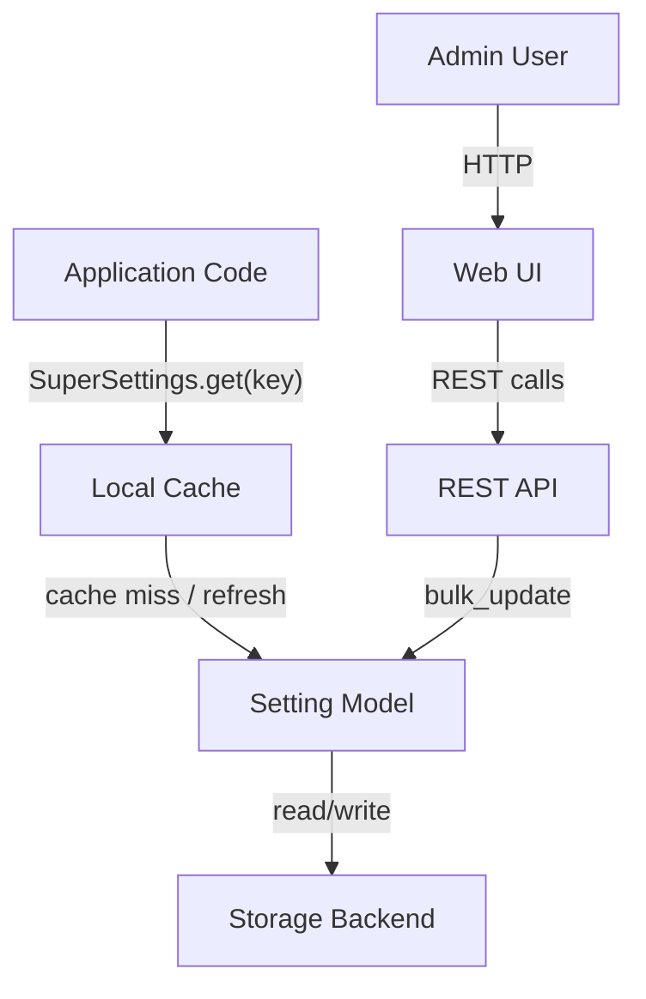
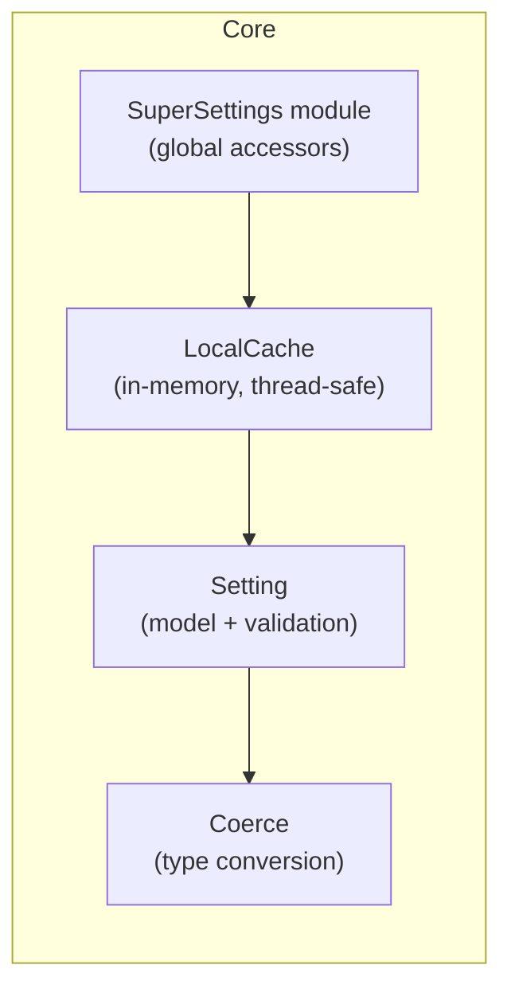
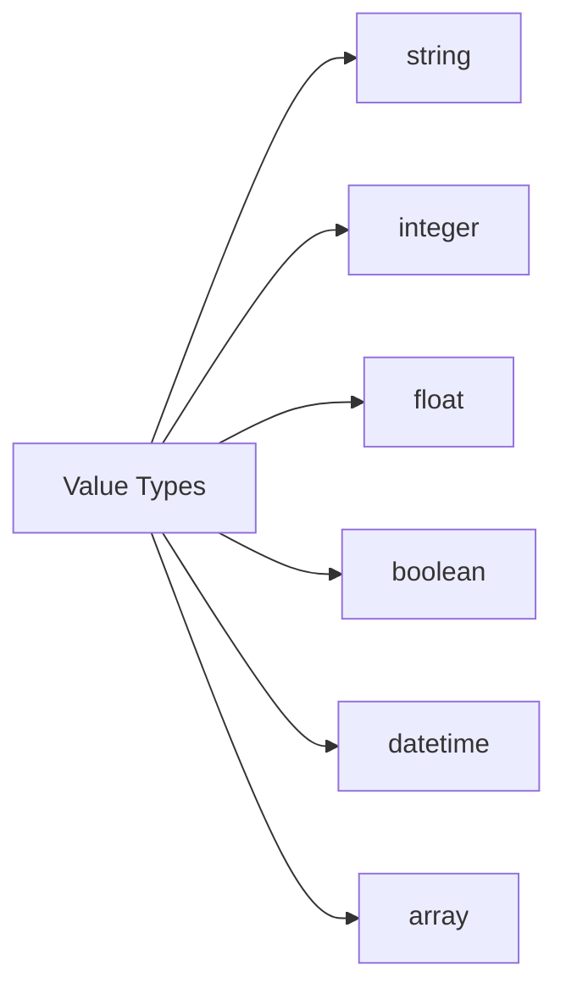
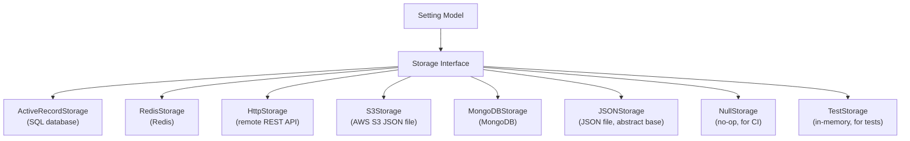
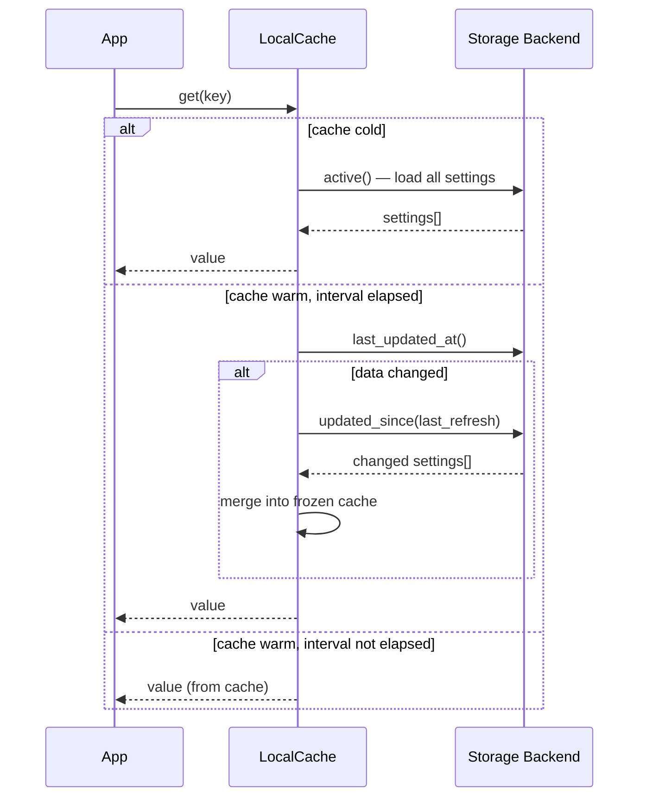
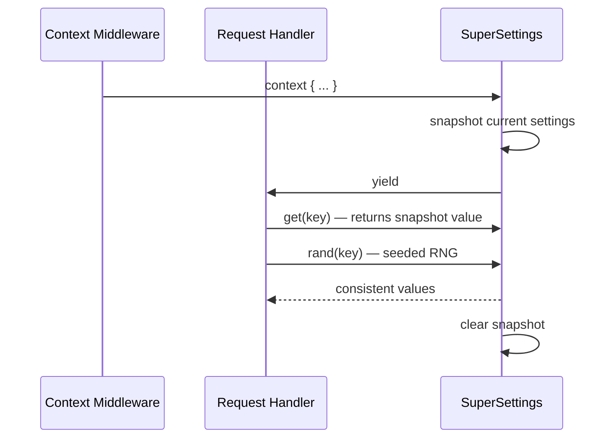
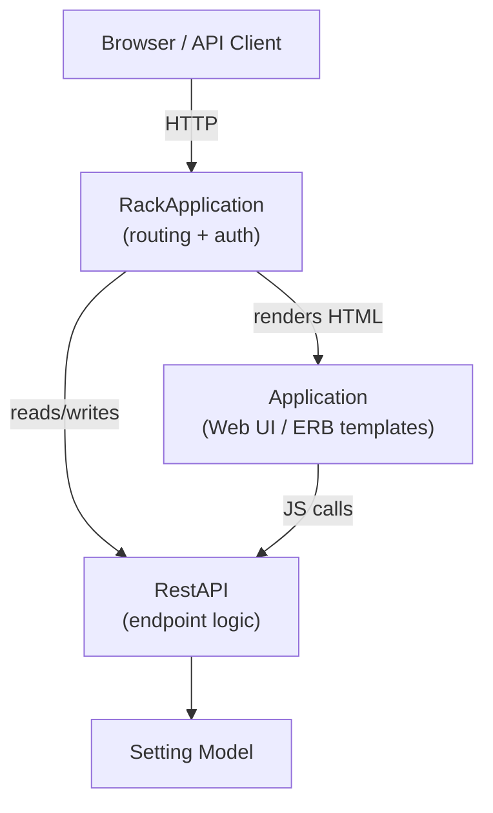
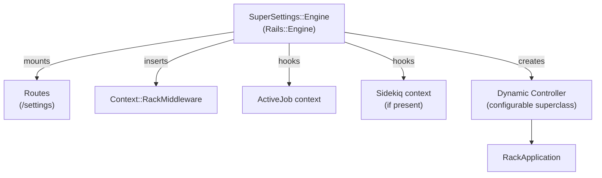
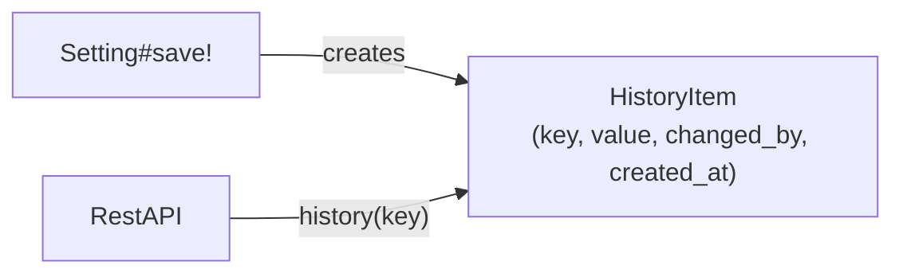
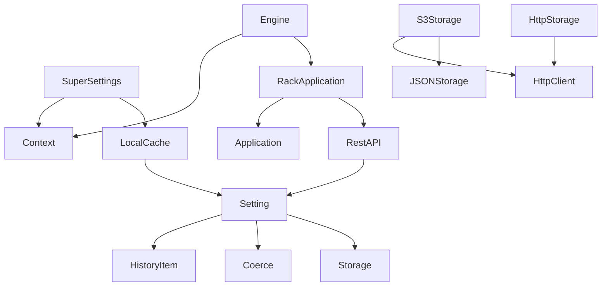

# SuperSettings Architecture

SuperSettings is a Ruby gem for managing dynamic application settings at runtime. Settings are persisted in a storage backend and cached in memory for fast, low-latency reads.

---

## High-Level Overview

---

## Core Components

| Component | Responsibility |
|---|---|
| `SuperSettings` | Public API — `get`, `integer`, `float`, `enabled?`, `datetime`, `array`, `rand` |
| `LocalCache` | Thread-safe in-memory cache with periodic delta refresh |
| `Setting` | Typed setting model with validation, change tracking, and bulk update |
| `Coerce` | Type coercion for string, integer, float, boolean, datetime, array |

---

## Setting Value Types

---

## Storage Layer

Storage backends implement a common interface. The active backend is selected at configuration time.

### Storage Interface

Each backend implements:
- `all` / `active` / `updated_since(time)` — bulk reads
- `find_by_key(key)` — single lookup
- `last_updated_at` — used for delta refresh
- `save!` — persist a setting
- `create_history` — record a change event
- `load_asynchronous?` — whether initial load can be deferred to a background thread

---

## Caching and Refresh

Key properties:
- Default refresh interval: **5 seconds**
- `last_updated_at` is itself cached (60s TTL) to reduce storage queries
- Refresh is delta-based — only changed settings are reloaded
- The cache is an **immutable frozen hash** replaced atomically on each refresh
- Initial load can be **asynchronous** (background thread) for some backends

---

## Request Context

Within a request or job, settings are snapshotted so the same key always returns the same value and random numbers are seeded for consistent probabilistic feature flags.

Context is propagated via a thread-local variable and is supported in:
- Rack requests — `Context::RackMiddleware`
- Sidekiq jobs — `Context::SidekiqMiddleware`
- ActiveJob — injected by the Rails Engine

---

## Web Interface and REST API

### REST Endpoints

| Method | Path | Description |
|---|---|---|
| GET | `/` | List all active settings |
| GET | `/setting` | Fetch a single setting by key |
| POST | `/settings` | Bulk update settings (atomic) |
| GET | `/history` | Change history for a setting |
| GET | `/settings/last_updated_at` | Timestamp of most recent change |
| GET | `/settings/updated_since` | Settings changed after a given time |

### Authentication

`RackApplication` exposes hooks to integrate with any auth system:
- `authenticated?` — gate all access
- `allow_read?` / `allow_write?` — fine-grained access control

---

## Rails Integration

The engine auto-configures when mounted:
- Inserts context middleware into the Rack stack
- Wraps ActiveJob and Sidekiq execution in a settings context
- Provides a controller with configurable authentication and layout
- Triggers settings load after `Rails.application` initializes

---

## Audit History

Every setting change is recorded as a history entry.

---

## Component Dependency Summary

