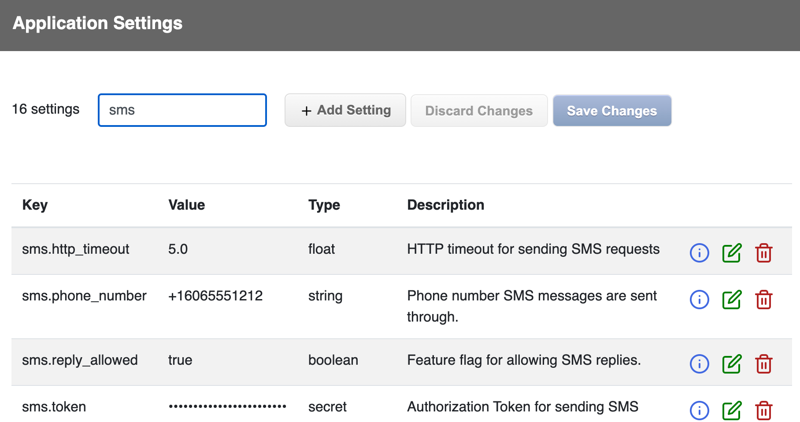

# SuperSettings

[](https://github.com/bdurand/super_settings/actions/workflows/continuous_integration.yml)
[](https://github.com/testdouble/standard)

This gem provides a framework for maintaining runtime application settings. Settings are persisted in a database and cached locally in memory for quick, efficient access. The settings are designed so they can be updated dynamically without requiring code deployment or restarting processes.

As applications grow, they tend to accumulate a lot of configuration over time. Often these end up in environment variables, hard coded in YAML files, or sprinkled through various data models as additional columns. All of these methods of configuration have their place and are completely appropriate for different purposes (i.e. for storing application secrets, configuration required during application startup, etc.).

However, these methods don't work as well for runtime settings that you may want to change while your application is running.

* Environment variables - These are great for environment specific configuration and they can be a good place to store sensitive data. However, they can be difficult to manage, all values must be stored as strings, and application processes need to be restarted for changes to take effect.

* YAML files - These are great for more complex configurations since they support data structures and they can be shipped with your application. However, changing them usually requires a new release of the application code.

* Database columns - These are great for settings tied to data models. However, they don't apply very well outside the data model, you need to build the tools for managing them into your application.

SuperSettings provides a simple interface for accessing settings backed by a thread safe caching mechanism that provides in-memory performance while significantly limiting database load. You can tune how frequently the cache is refreshed and each refresh call is tuned to be highly efficient.

There is also an out of the box web UI and REST API for managing settings. You can specify data types for your settings (string, integer, float, boolean, datetime, or array) and be assured that values will be valid. You can also supply documentation for each setting so that it's obvious what each one does and how it is used.

## Usage

* [Getting Value](#getting_values)
  * [Hashes](#hashes)
  * [Defaults](#defaults)
  * [Caching](#caching)
* [Data Model](#data_model)
  * [Storage Engines](#storage_engines)
  * [Encrypted Secrets](#encrypted_secrets)
* [Web UI](#web_ui)
  * [REST API](#rest_api)
* [Rails Engine](#rails_engine)
  * [Configuration](#configuration)

### Getting Values

This gem is in essence a key/value store. Settings are identified by unique keys and contain a typed value. You can access setting values using methods on the `SuperSettings` object.

```ruby
SuperSettings.get("key") # -> returns a string

SuperSettings.integer("key") # -> returns an integer

SuperSettings.float("key") # -> returns a float

SuperSettings.enabled?("key") # -> returns a boolean

SuperSettings.datetime("key") # -> returns a `Time` object

SuperSettings.array("key") # -> returns an array of strings
```

#### Hashes
There is also a method to get multiple settings at once structured as a Hash.

```ruby
SuperSettings.structured("parent") # -> returns an hash
```

The key provided to the `SuperSettings.structured` method indicates the key prefix and constructs the hash from settings that have keys beginning with that prefix. Keys are also broken down by a delimiter so you can create nested hashes. The delimiter defaults to `"."`, but you can specify a different one with the `delimiter` keyword argument.

You can also set a maximum depth to the returned hash with the `max_depth` keyword argument.

So, if you have the following settings:

```
vendors.company_1.path = "/co1"
vendors.company_1.timeout = 5
vendors.company_2.path = "/co2"
page_size = 20
```

You would get these results:

```ruby
SuperSettings.structured("vendors")
# {
#   "company_1" => {
#     "path" => "/co1",
#     "timeout" => 5
#   },
#   "company_2" => {
#     "path" => "/co2"
#    }
# }

SuperSettings.structured("vendors.company_1")
# {"path" => "/co1", "timeout" => 5}

SuperSettings.structured("vendors.company_2")
# {"path" => "/co2"}

# Get all the settings by omitting the key
SuperSettings.structured
# {
#   "vendors" => {
#     "company_1" => {"path" => "/co1", "timeout" => 5},
#     "company_2" => {"path" => "/co2"}
#   },
#   "page_size" => 20
# }

# Limit the depth of the returned has to one level
SuperSettings.structured(max_depth: 1)
# {
#   "vendors.company_1.path => "/co1",
#   "vendors.company_1.timeout" => 5,
#   "vendors.company_2.path" => "/co2",
#   "page_size" => 20
# }
```

#### Defaults

When you request a setting, you can also specify a default value to use if the setting does not have a value.

```ruby
SuperSettings.integer("key", 4)
# return 4 if the "key" setting has not been set
```

#### Caching

When you read a setting using these methods, you are actually reading from an in memory cache. All of the settings are read into this local cache and the cache is checked periodically to see if it needs to be refreshed (defaults to every five seconds, but can be customized with `SuperSettings.refresh_interval`). When the cache does need to be refreshed, only updated records are re-read from the data store by a single background thread. Thus, you don't have to worry about overloading your database by reading settings values.

Cache misses are also cached so that they don't add any overhead. You should avoid querying for dynamically generated values as a setting key since this can lead to memory bloat.

```ruby
# BAD: this will create an entry in the cache for every id
SuperSettings.enabled?("enabled_users.#{id}")

# GOOD: use an array if there are a limited number of values
SuperSettings.array("enabled_users", []).include?(id)

# GOOD: use a hash if you need to scale to any number of values
SuperSettings.structured("enabled_users", {})["id"]
```

Because all settings must be read into memory, you should avoid creating thousands of settings since this could lead to performance or memory issues loading the cache.

### Data Model

Each setting has a unique key, a value, a value type, and an optional description. The value type can be one of "string", "integer", "float", "boolean", "datetime", "array", or "secret". The array value type will always return an array of strings. The secret value type also returns a string and is used to indicate that the value contains sensitive data that should not be exposed. Secret values can be encrypted in the database as well (see below).

The value type on a setting does not limit how it can be cast when request using one of the accessor methods on `SuperSettings`, though. For instance, you can call `SuperSettings.get("integer_key")` on an integer setting and it will return a string. The value type does ensure that the value is validated to be sure it can be cast to the specified type so you can avoid inputing invalid data.

It is not possible to store an empty string in a setting; empty strings will be always cast to `nil`.

A history of all settings changes is kept every time the value is changed in the `histories` association. You can use this information to see what values were in effect at what time. You can optionally alse record who made the changes.

#### Storage Engines

This gem abstracts out the storage engine and can support multiple storage mechanisms. It has built in support for ActiveRecord, Redis, and HTTP storage.

* `SuperSettings::Storage::ActiveRecordStorage` - Stores the settings in a relational database using ActiveRecord. This is the default storage engine for Rails applications.
* `SuperSettings::Storage::RedisStorage` - Stores the settings in a Redis database using the [redis](https://github.com/redis/redis-rb) gem.
* `SuperSettings::Storage::HttpStorage` - Uses the SuperSettings REST API running on another server. This is useful in a micro services architecture so you can have a central settings server used by all the services.

Additional storage engines can be built by creating a class that includes `SuperSettings::Storage` and implementing the unimplemented methods in that module.

The storage engine is defined by setting `SuperSettings::Setting.storage` to the storage class to use. Note that each storage class may also require additional configuration. For instance the Redis storage class requires you to provide a connection to a Redis database. If you are running a Rails application, then the storage engine will be set to ActiveRecord by default. Otherwise, you will need to define it somewhere in your application's initialization.

#### Encrypted Secrets

You can specify that a setting is a secret by setting the value type to "secret". This will obscure the value in the UI (thoough it can still be seen when editing) as well as avoid recording the values in the setting history.

You can also specify an encryption secret that is used to encrypt these settings in the database. It is highly recommended that if you store secrets in your settings that you enable this feature. The enryption secret can either be set by setting `SuperSettings.secret` or by setting the `SUPER_SETTINGS_SECRET` environment variable.

If you need to roll your secret key, you can set the `SuperSettings.secret` value as an array (or as a space delmited list in the environment variable). The first secret will be the one used to encrypt values. However, all the secrets will be tried when decrypting values. This allows you to change the secret without raising decryption errors. If you do change your secret, you can run this rake task to re-encrypt all values using the new secret:

```bash
rake super_settings:encrypt_secrets
```

Encryption only changes how values are stored in the data store. Encrypted secrets are protected from someone gaining direct access to your database or a database backup and should be used if you are storing sensitive values. However, the values are not encrypted in the REST API or web UI. You must take appropriate measures to secure these if you choose to use them.

### Web UI

The Web UI provides all the functionality to add, update, and delete settings.



You can save multiple settings at once. If you have settings that need to be changed together, you can be assured they will all be saved in a single transaction.

The Web UI is fully self contained and has no external dependencies. There are configuration settings for tweaking the layout. See the `SuperSettings::Configuration` class for

You can see the Web UI in action if you clone this repository and then run:

```bash
bin/start_rails
```

Then go to http://localhost:3000/settings in your browser.

You can change the layout used by the web UI. However, if you do this, you will be responsible for providing the CSS styles for the buttons, table rows and the form controls. The CSS class names used by the default layout are compatible with the class names defined in the [Bootstrap library](https://getbootstrap.com/).

It is not required to use the bundled web UI. You can implement your own UI if you need to using the `SuperSettings::Setting` model.

#### REST API

You can mount a REST API for the exposing and managing the settings. This API is required for the web UI. The REST interface is documented in the `SuperSettings::RestAPI` class.

If you are running a Rails application, you can mount the API as a controller via the bundled Rails engine. If you are not using Rails, then you can add a class that extends `SuperSettings::RackMiddleware` to your Rack middleware stack.

In either case, you are responsible for implementing authentication and authorization for the HTTP requests. This allows you to seamlessly integrate with existing authentication and authorization in your application.

### Rails Engine

The gem ships with a Rails engine that provides easy integration with a Rails application.

The default storage engine for a Rails application will be the ActiveRecord storage. You need to install the database migrations first with:

```bash
rails app:super_settings:install:migrations
```

You also need to mount the engine routes in your application's `config/routes.rb` file. The routes can be mounted under any prefix you'd like.

```ruby
mount SuperSettings::Engine => "/settings"
```

See the configuration section below for information about how to secure the controller endpoints. The engine provides no mechanism for security out of the box, but it is designed to seamlessly integrate with your application's existing authentication and authorization mechanism.

#### Configuration

You can configure various aspects of the Rails engine using by calling `SuperSettings.configure` in an initializer.

```ruby
# config/initializers/super_settings.rb

SuperSettings.configure do |config|
  # These options can be used to customize the header in the web UI.
  config.controller.application_name = "My Application"
  config.controller.application_link = "/"
  config.controller.application_logo = "/images/app_logo.png"

  # Set a custom refresh interval for the cache (default is 5 seconds)
  config.refresh_interval = 2

  # Set a secret used for encrypting settings with the "secret" value type.
  config.secret = "ad962cc27e02657795a61b8d48a31ce4"

  # Set the superclass to use for the controll. Defaults to using `ApplicationController`.
  config.controller.superclass = Admin::BaseController

  # Add additional code to the controller. In this case we are adding code to ensure only
  # admins can access the functionality and changing the layout to use one defined by the application.
  config.controller.enhance do
    self.layout = "admin"

    before_action do
      require_admin
    end

    private

    def require_admin
      if current_user.nil?
        redirect_to login_url, status: 401
      else
        redirect_to access_denied_url, status: 403
      end
    end
  end

  # Define a method that returns the value that will be stored in the settings history in
  # the `changed_by` column.
  config.controller.define_changed_by do
    current_user.name
  end

  # You can define the storage engine for the model. This can be either done either with a Class
  # object or with a symbol matching the underscored class name of a storage class defined under
  # the SuperSettings::Storage namespace.
  # config.model.storage = :active_record

  # You can also specify a cache implementation to use to cache the last updated timestamp
  # for model changes. By default this will use `Rails.cache`.
  # config.model.cache = Rails.cache
end
```

One configuration you will probably want to set is the superclass for the controller. By default, the base `ApplicationController` defined for your application will be used. However, if you want to provide Your application probably already has a

## Installation

Add this line to your application's Gemfile:

```ruby
gem 'super_settings'
```

And then execute:
```bash
$ bundle
```

Or install it yourself as:
```bash
$ gem install super_settings
```

## Contributing

Open a pull request on GitHub.

Please use the [standardrb](https://github.com/testdouble/standard) syntax and lint your code with `standardrb --fix` before submitting.

## License

The gem is available as open source under the terms of the [MIT License](https://opensource.org/licenses/MIT).
