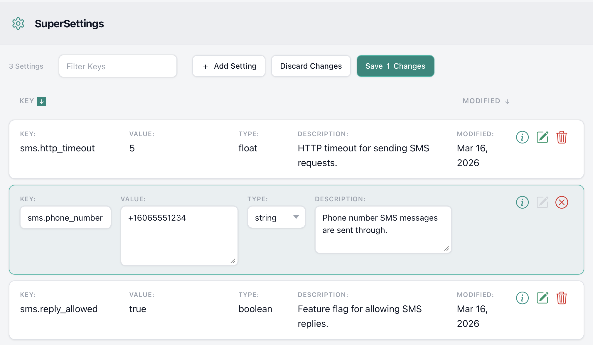

# SuperSettings

[](https://github.com/bdurand/super_settings/actions/workflows/continuous_integration.yml)
[](https://github.com/testdouble/standard)
[](https://badge.fury.io/rb/super_settings)

SuperSettings is a Ruby gem that provides a scalable framework for maintaining runtime application settings. Settings are persisted in a database but cached in memory for quick, efficient access. This design ensures settings can be updated dynamically without requiring code deployment or process restarts, making it ideal for high-throughput environments.

As applications grow, they often accumulate a large number of configuration options. Common approaches such as environment variables, YAML files, or additional database columns all have their place:

- **Environment variables** are suitable for environment-specific configuration, but require restarts for changes to take effect and can only store string values.
- **YAML files** offer support for complex data structures and can be bundled with application code but typically require a new release to update.
- **Database columns** - These are great for settings tied to data models; however, they don’t apply well outside of the data model, and you need to build custom tools to manage them in your application.

Key features include:

- **Caching:** A thread-safe, in-memory caching mechanism ensures high-performance access to settings, while minimizing database load. Cache refreshes are highly efficient and configurable.
- **Dynamic Updates:** Settings can be changed on the fly, with automatic logging of changes to maintain an audit trail for compliance.
- **Data Types and Validation:** Settings can be defined with specific data types (string, integer, float, boolean, datetime, or array) to ensure validity.
- **Documentation:** Each setting can include a description to explain its purpose and usage.
- **Web UI and REST API:** Manage settings via a built-in web interface or REST API.
- **Custom Callbacks:** Execute custom logic whenever a setting changes, enabling more sophisticated behavior for logging and compliance.
- **Pluggable Data Storage:** SuperSettings supports multiple storage engines, including ActiveRecord, Redis, and S3. You can also chain it to another application running SuperSettings via the HTTP storage engine to allow microservices to share settings.

For projects that require a combination of runtime settings, environment variables, and YAML files, SuperSettings integrates seamlessly with [ultra_settings](https://github.com/bdurand/ultra_settings), creating a flexible and powerful configuration system.

## Table Of Contents

- [Usage](#usage)
  - [Getting Value](#getting-values)
    - [Hashes](#hashes)
    - [Defaults](#defaults)
    - [Caching](#caching)
  - [Data Model](#data-model)
    - [Storage Engines](#storage-engines)
  - [Web UI](#web-ui)
    - [REST API](#rest-api)
    - [Authentication](#authentication)
  - [Rails Engine](#rails-engine)
    - [Configuration](#configuration)
- [Installation](#installation)
- [Contributing](#contributing)
- [License](#license)

## Usage

### Getting Values

This gem is, in essence, a key/value store. Settings are identified by unique keys and contain a typed value. You can access setting values using methods on the `SuperSettings` object.

```ruby
SuperSettings.get("key") # -> returns a string

SuperSettings.integer("key") # -> returns an integer

SuperSettings.float("key") # -> returns a float

SuperSettings.enabled?("key") # -> returns a boolean

SuperSettings.datetime("key") # -> returns a `Time` object

SuperSettings.array("key") # -> returns an array of strings
```


#### Defaults

When you request a setting, you can also specify a default value to use if the setting does not have a value.

```ruby
SuperSettings.integer("key", 4)
# return 4 if the "key" setting has not been set
```

#### Caching

When you read a setting using these methods, you are actually reading from an in-memory cache. All of the settings are read into this local cache and checked periodically to see if the cache needs to be refreshed (defaults to every five seconds, but can be customized with `SuperSettings.refresh_interval`). When the cache needs to be refreshed, only the delta of updated records are re-read from the data store by a single background thread to minimize any load on the server.

Cache misses are also cached so they don't add any overhead. Because of this, you should avoid using dynamically generated values as keys since this can lead to memory bloat.

```ruby
# BAD: this will create an entry in the cache for every id
SuperSettings.enabled?("enabled_users.#{id}")

# GOOD: use an array if there are a limited number of values
SuperSettings.array("enabled_users", []).include?(id)
```

The cache will scale without issue to handle hundreds of settings. However, you should avoid creating thousands of settings. Because all settings are read into memory, having too many settings records can lead to performance or memory issues.

#### Request Context

You can ensure that settings won't change in a block of code by surrounding it with a `SuperSettings.context` block. Inside a `context` block, a setting will always return the same value. This can prevent race conditions where you code may branch based on a setting value.

```ruby
# This code could be unsafe since the value of the "threshold" setting could
# change after the if statement is checked.
if SuperSettings.integer("threshold") > 0
  do_something(SuperSettings.integer("threshold"))
end

# With a context block, the value for the "threshold setting will always
# return the same value
SuperSettings.context do
  if SuperSettings.integer("threshold") > 0
    do_something(SuperSettings.integer("threshold"))
  end
end
```

You can also use the `SuperSettings.rand` method inside a context block to return a consistent random number. This can be useful for things like feature flags that you want to turn on for only a percentage of requests:

```ruby
def enabled?
  SuperSettings.float("feature_rollout_percent") <= SuperSettings.rand
end
```

Now the value of `enabled?` will always return the same value inside of a context block. It will still be random if it is enabled for each context block.

It's a good idea to add a `context` block around your main unit of work:

- Rack application: add `SuperSettings::Context::RackMiddleware` to your middleware stack
- Sidekiq: add `SuperSettings::Context::SidekiqMiddleware` to your server middleware
- ActiveJob: add an `around_perform` callback that calls `SuperSettings.context`

In a Rails application all of these will be done automatically.

### Data Model

Each setting has a key, value, value type, and optional description. The key must be unique. The value type can be one of "string", "integer", "float", "boolean", "datetime", or "array". The array value type will always return an array of strings.

You can request a setting using one of the accessor methods on `SuperSettings` regardless of its defined value type. For instance, you can call `SuperSettings.get("integer_key")` on an integer setting and it will return the value as a string. The value type of a setting is only used for validating input values and does not limit how you can request the value at runtime.

It is not possible to store an empty string in a setting; empty strings will be always be returned as `nil`.

A history of all settings changes is updated every time the value is changed in the `histories` association. You can also record who made the changes.

#### Callbacks

You can define custom callbacks on the `SuperSettings::Setting` model that will be called whenever a setting is changed. For example, if you needed to log all changes to you settings in your application logs, you could do something like this:

```ruby
SuperSettings::Setting.after_save do |setting|
  Application.logger.info("Setting #{setting.key} changed: #{setting.changes.inspect})
end
```

#### Storage Engines

This gem abstracts out the storage engine and can support multiple storage mechanisms. It has built in support for ActiveRecord, Redis, and HTTP storage.

* `SuperSettings::Storage::ActiveRecordStorage` - Stores the settings in a relational database using ActiveRecord. This is the default storage engine for Rails applications.
* `SuperSettings::Storage::RedisStorage` - Stores the settings in a Redis database using the [redis](https://github.com/redis/redis-rb) gem.
* `SuperSettings::Storage::HttpStorage` - Uses the SuperSettings REST API running on another server. This is useful in a microservices architecture so you can have a central settings server used by all the services.
* `SuperSettings::Storage::S3Storage` - Stores the settings in JSON in an S3 object. This is useful for applications running on AWS that want to store settings in a central location since it does not require a dedicated database. It is possible to read the settings directly from S3 from another application.
* `SuperSettings::Storage::MongoDBStorage` - Stores the settings in a MongoDB database using the [mongo](https://github.com/mongodb/mongo-ruby-driver) gem.
* `SuperSettings::Storage::NullStorage` - Does not store settings at all. This is useful for testing or when the storage engine is not available in your continuous integration environment.

Additional storage engines can be built by creating a class that includes `SuperSettings::Storage` and implements the unimplemented methods in that module.

The storage engine is defined by setting `SuperSettings::Setting.storage` to a storage class. Note that each storage class may also require additional configuration. For instance, the Redis storage class requires you to provide a connection to a Redis database. If you are running a Rails application, then the storage engine will be set to ActiveRecord by default. Otherwise, you will need to define the storage class somewhere in your application's initialization. See the storage class documentation for more information.

### Web UI

The Web UI provides all the functionality to add, update, and delete settings.



You can save multiple settings at once. If you have settings that need to be changed together, you can ensure they will all be saved in a single transaction.

The Web UI is fully self-contained and has no external dependencies. There are configuration settings for tweaking the layout. See the `SuperSettings::Configuration` class for details if you are using Rails or `SuperSettings::RackApplication` if you are not.

You can see the Web UI in action if you clone this repository and then run:

```bash
bin/start_rails
```

Then go to http://localhost:3000/settings in your browser.

You can change the layout used by the Web UI. However, if you do this, you will be responsible for providing the CSS styles for the buttons, table rows, and form controls. The CSS class names used by the default layout are compatible with the class names defined in the [Bootstrap library](https://getbootstrap.com/).

It is not required to use the bundled Web UI. You can implement your own UI using the `SuperSettings::Setting` model.

You can link directly to editing a setting by passing `#edit=key` in the URL hash. This will open the Web UI with the setting with the key `key` selected for editing.

#### REST API

You can mount a REST API for exposing and managing the settings. This API is required for the Web UI and is mounted along with the Web UI. The REST interface is documented in the `SuperSettings::RestAPI` class.

If you are running a Rails application, you can mount the API as a controller via the bundled Rails engine. If you are not using Rails, then you can add a class that extends `SuperSettings::RackApplication` to your Rack middleware stack. The web UI can be disabled and only the REST API exposed. See `SuperSettings::Configuration` if you are using Rails or `SuperSettings::RackApplication` if you are not.

#### Authentication

You are responsible for implementing authentication on the Web UI and REST API endpoints. In a Rack application, you would do this by putting the Supersetting application behind Rack middleware the performs your authentication checks. In a Rails application, you can add a `before_action` filter to hook into your authentication checks.

If you are using access token authentication from a single-page application (as opposed to cookie-based authentication), you will need to pass the access token from the browser to the backend. There are a couple of built-in ways to do this.

You can pass the access token in either the `access_token` query parameter to the Web UI or as the URL hash. Both of these are equivalent:

```
https://myapp.example.com/settings?access_token=secrettokenstring

https://myapp.example.com/settings#access_token=secrettokenstring
```

If you use the above method, you would construct these URL's from a part of your application that already has the access token. The access token will be removed from the URL in the browser history and stored in the window's session storage so that it can be sent with each API request.

Alternatively, you can specify a piece of Javascript in `SuperSettings.web_ui_javascript` that will be injected into the Web UI. You can use this to set whatever authentication header you need to on the API requests in the `SuperSettingsAPI.headers` Javascript object.

```ruby
SuperSettings.web_ui_javascript = "SuperSettingsAPI.headers['Authorization'] = window.localStorage.getItem('access_token')"
```

You can also specify the URL for a login page with `SuperSettings.authentication_url`. Browsers will be redirected to this URL if a request requiring authentication is received.

### Rails Engine

The gem ships with a Rails engine that provides easy integration with a Rails application.

The default storage engine for a Rails application will be the ActiveRecord storage. You need to install the database migrations first with:

```bash
rails super_settings:install:migrations
```

You also need to mount the engine routes in your application's `config/routes.rb` file. The routes can be mounted under any prefix you'd like.

```ruby
mount SuperSettings::Engine => "/settings"
```

See the configuration section below for information about how to secure the controller endpoints. The engine provides no mechanism for security out of the box, but it is designed to seamlessly integrate with your application's existing authentication and authorization mechanism.

#### Configuration

You can configure various aspects of the Rails engine using by calling `SuperSettings.configure` in an initializer.

```ruby
# config/initializers/super_settings.rb

SuperSettings.configure do |config|
  # These options can be used to customize the header in the Web UI.
  config.controller.application_name = "My Application"
  config.controller.application_link = "/"
  config.controller.application_logo = "/images/app_logo.png"

  # Set a custom refresh interval for the cache (default is 5 seconds)
  config.refresh_interval = 10

  # Set the superclass to use for the controller. Defaults to using `ApplicationController`.
  config.controller.superclass = Admin::BaseController

  # Set the color scheme to use for the Web UI. Options are :light (default), :dark, or :system.
  config.controller.color_scheme = :dark

  # Add additional code to the controller. In this case we are adding code to ensure only
  # admins can access the functionality and changing the layout to use one defined by the application.
  config.controller.enhance do
    self.layout = "admin"

    before_action do
      require_admin
    end

    private

    def require_admin
      if current_user.nil?
        redirect_to login_url, status: 401
      elsif !current_user.admin?
        redirect_to access_denied_url, status: 403
      end
    end
  end

  # Define a block that returns the value that will be stored in the settings history in
  # the `changed_by` column.
  config.controller.define_changed_by do
    current_user.id
  end

  # Define a block that determines how to display the `changed_by`` value in the setting history.
  config.model.define_changed_by_display do |changed_by_id|
    User.find_by(id: changed_by_id)&.name
  end

  # You can define the storage engine for the model. This can be either done either with a Class
  # object or with a symbol matching the underscored class name of a storage class defined under
  # the SuperSettings::Storage namespace.
  # config.model.storage = :active_record

  # You can also specify a cache implementation to use to cache the last updated timestamp
  # for model changes. By default this will use `Rails.cache`.
  # config.model.cache = Rails.cache

  # You can define after_save callbacks for the model.
  # config.model.after_save do |setting|
  #   Rail.logger.info("Setting #{setting.key} changed to #{setting.value.inspect}")
  # end
end
```

#### Using your own controller

You can embed the SuperSettings web UI into your own templates. This gives you the option to more tightly integrate it with your application's navigation and look and feel.

First disable the web UI in the configuration since you won't need it.

```ruby
# config/initializers/super_settings.rb

SuperSettings.configure do |config|
  # Disable the built in web UI since you won't be using it.
  config.controller.web_ui_enabled = false
end
```

Create your controller that will render the SuperSettings web UI.

```ruby
class AppSettingsController < ApplicationController
  def index
  end
end
```

Mount the engine routes in your `config/routes.rb` file.

```ruby
# config/routes.rb

Rails.application.routes.draw do
  mount SuperSettings::Engine => "/settings"

  controller :app_settings do
    get "/app_settings", action: :index
  end
end
```

Create a view that embeds the SuperSettings web UI using the `SuperSettings::Application` class. You need to specify the path you mounted the engine at as the base URL for the REST API.

```erb
# app/views/app_settings/index.html.erb

<h1>Application Settings</h1>

<%= SuperSettings::Application.new(api_base_url: "/settings").render %>
```

## Installation

Add this line to your application's Gemfile:

```ruby
gem 'super_settings'
```

And then execute:
```bash
$ bundle
```

Or install it yourself as:
```bash
$ gem install super_settings
```

## Contributing

Open a pull request on GitHub.

Please use the [standardrb](https://github.com/testdouble/standard) syntax and lint your code with `standardrb --fix` before submitting.

You can run a local Rails development using ActiveRecord storage with

```bash
# Initialize the database (one time only)
bin/rails bin/rails super_settings:install:migrations
bin/rails db:migrate

# Start the server
bin/rails s
```

You can also bring up a local rack server with

```bash
bundle exec rackup
```

By default this will use Redis for storage using the default Redis URL. You can change the storage engine with the `STORAGE` environment variable.

- `active_record` - Use the ActiveRecord storage engine.
- `redis` - Use the Redis storage engine. The Redis URL can be set with the `REDIS_URL` environment variable.
- `http` - Use the HTTP storage engine. The URL for the REST API can be set with the `REST_API_URL` environment variable.
- `s3` - Use the S3 storage engine. The S3 URL can be set with the `S3_URL` environment variable.
- `mongodb` - Use the MongoDB storage engine. The MongoDB URL can be set with the `MONGODB_URL` environment variable.
- `null` - Use the null storage engine. This storage engine does not store settings at all.

You can bring up all of these storage engines locally with the included docker-compose configuration.

```bash
docker-compose up
```

This will work out of the box with the defaults for the storage engines when running the rack server.:

- `REDIS_URL` - `redis://localhost:6379/0`
- `REST_API_URL` - `http://localhost:3000/settings` (this is the default URL for the Rails application)
- `S3_URL` - `s3://accesskey:secretkey@region-1/settings/settings.json` (the S3 endpoint will be set to `http://localhost:9000`)
- `MONGODB_URL` - `mongodb://localhost:27017/super_settings`

Finally, you can run the application in dark mode by setting the `COLOR_SCHEME` environment variable.

```bash
COLOR_SCHEME=dark bundle exec rackup
```

## License

The gem is available as open source under the terms of the [MIT License](https://opensource.org/licenses/MIT).
