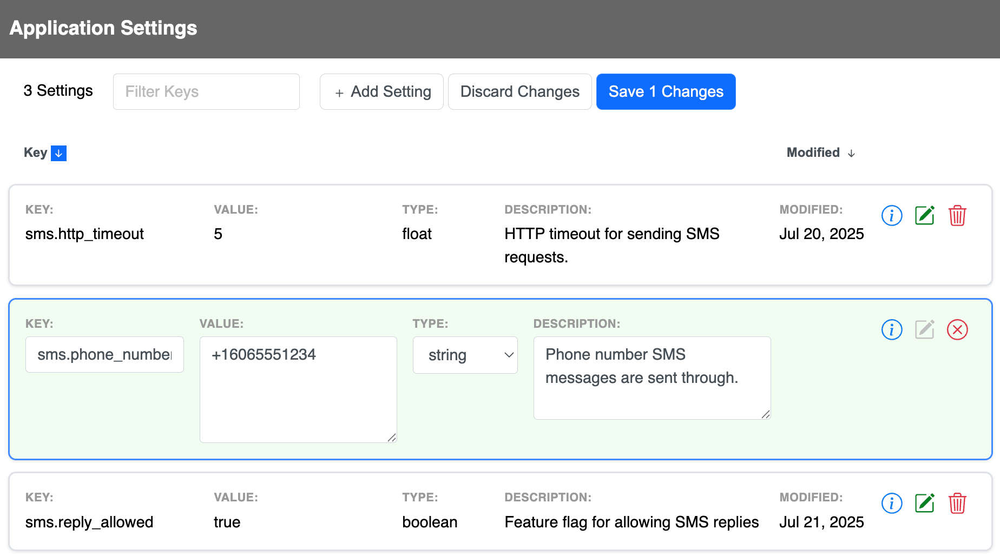

# SuperSettings

[](https://github.com/bdurand/super_settings/actions/workflows/continuous_integration.yml)
[](https://github.com/testdouble/standard)

This gem provides a framework for maintaining runtime application settings. Settings are persisted in a database but cached in memory for quick, efficient access. The settings are designed so they can be updated dynamically without requiring code deployment or restarting processes. The code scales very well and can easily handle very high throughput environments.

As applications grow, they tend to accumulate many configuration options. Often these end up in environment variables, hard coded in YAML files, or sprinkled through various data models as additional columns. All of these methods of configuration have their place and are completely appropriate for different purposes (i.e. for storing application secrets, configuration required during application startup, etc.).

However, these methods don't work as well for runtime settings that you may want to change while your application is running.

- **Environment variables** - These are great for environment-specific configuration and they can be a good place to store sensitive data. However, they can be difficult to manage. All values must be stored as strings, and application processes need to be restarted for changes to take effect.

- **YAML files** - These are great for more complex configurations because they support data structures and they can be shipped with your application code. However, changing them usually requires a new release of the application.

- **Database columns** - These are great for settings tied to data models, however, they don't apply very well outside the data model, and you need to build the tools for managing them into your application.

SuperSettings provides a simple interface for accessing settings backed by a thread-safe caching mechanism, which provides in-memory performance while significantly limiting any load on the database. You can tune how frequently the cache is refreshed and each refresh call is tuned to be highly efficient.

There is also an out of the box Web UI and REST API for managing settings. You can specify data types for your settings (string, integer, float, boolean, datetime, or array) to ensure that values will be valid. You can also supply documentation for each setting so that it's clear what each one does and how it is used.

There is a companion gem [ultra_settings](https://github.com/bdurand/ultra_settings) that can be used to integrate SuperSettings into a combined configuration system alongside YAML files and environment variables.

## Usage

- [Getting Value](#getting-values)
  - [Hashes](#hashes)
  - [Defaults](#defaults)
  - [Caching](#caching)
- [Data Model](#data-model)
  - [Storage Engines](#storage-engines)
- [Web UI](#web-ui)
  - [REST API](#rest-api)
  - [Authentication](#authentication)
- [Rails Engine](#rails-engine)
  - [Configuration](#configuration)

### Getting Values

This gem is, in essence, a key/value store. Settings are identified by unique keys and contain a typed value. You can access setting values using methods on the `SuperSettings` object.

```ruby
SuperSettings.get("key") # -> returns a string

SuperSettings.integer("key") # -> returns an integer

SuperSettings.float("key") # -> returns a float

SuperSettings.enabled?("key") # -> returns a boolean

SuperSettings.datetime("key") # -> returns a `Time` object

SuperSettings.array("key") # -> returns an array of strings
```


#### Defaults

When you request a setting, you can also specify a default value to use if the setting does not have a value.

```ruby
SuperSettings.integer("key", 4)
# return 4 if the "key" setting has not been set
```

#### Caching

When you read a setting using these methods, you are actually reading from an in-memory cache. All of the settings are read into this local cache and checked periodically to see if the cache needs to be refreshed (defaults to every five seconds, but can be customized with `SuperSettings.refresh_interval`). When the cache needs to be refreshed, only the delta of updated records are re-read from the data store by a single background thread to minimize any load on the server.

Cache misses are also cached so they don't add any overhead. Because of this, you should avoid using dynamically generated values as keys since this can lead to memory bloat.

```ruby
# BAD: this will create an entry in the cache for every id
SuperSettings.enabled?("enabled_users.#{id}")

# GOOD: use an array if there are a limited number of values
SuperSettings.array("enabled_users", []).include?(id)
```

The cache will scale without issue to handle hundreds of settings. However, you should avoid creating thousands of settings. Because all settings are read into memory, having too many settings records can lead to performance or memory issues.

#### Request Context

You can ensure that settings won't change in a block of code by surrounding it with a `SuperSettings.context` block. Inside a `context` block, a setting will always return the same value. This can prevent race conditions where you code may branch based on a setting value.

```ruby
# This code could be unsafe since the value of the "threshold" setting could
# change after the if statement is checked.
if SuperSettings.integer("threshold") > 0
  do_something(SuperSettings.integer("threshold"))
end

# With a context block, the value for the "threshold setting will always
# return the same value
SuperSettings.context do
  if SuperSettings.integer("threshold") > 0
    do_something(SuperSettings.integer("threshold"))
  end
end
```

It's a good idea to add a `context` block around your main unit of work:

- Rack application: add `SuperSettings::Context::RackMiddleware` to your middleware stack
- Sidekiq: add `SuperSettings::Context::SidekiqMiddleware` to your server middleware
- ActiveJob: add an `around_perform` callback that calls `SuperSettings.context`

In a Rails application all of these will be done automatically.

### Data Model

Each setting has a key, value, value type, and optional description. The key must be unique. The value type can be one of "string", "integer", "float", "boolean", "datetime", or "array". The array value type will always return an array of strings.

You can request a setting using one of the accessor methods on `SuperSettings` regardless of its defined value type. For instance, you can call `SuperSettings.get("integer_key")` on an integer setting and it will return the value as a string. The value type of a setting is only used for validating input values and does not limit how you can request the value at runtime.

It is not possible to store an empty string in a setting; empty strings will be always be returned as `nil`.

A history of all settings changes is updated every time the value is changed in the `histories` association. You can also record who made the changes.

#### Storage Engines

This gem abstracts out the storage engine and can support multiple storage mechanisms. It has built in support for ActiveRecord, Redis, and HTTP storage.

* `SuperSettings::Storage::ActiveRecordStorage` - Stores the settings in a relational database using ActiveRecord. This is the default storage engine for Rails applications.
* `SuperSettings::Storage::RedisStorage` - Stores the settings in a Redis database using the [redis](https://github.com/redis/redis-rb) gem.
* `SuperSettings::Storage::HttpStorage` - Uses the SuperSettings REST API running on another server. This is useful in a microservices architecture so you can have a central settings server used by all the services.

Additional storage engines can be built by creating a class that includes `SuperSettings::Storage` and implements the unimplemented methods in that module.

The storage engine is defined by setting `SuperSettings::Setting.storage` to a storage class. Note that each storage class may also require additional configuration. For instance, the Redis storage class requires you to provide a connection to a Redis database. If you are running a Rails application, then the storage engine will be set to ActiveRecord by default. Otherwise, you will need to define the storage class somewhere in your application's initialization.

### Web UI

The Web UI provides all the functionality to add, update, and delete settings.



You can save multiple settings at once. If you have settings that need to be changed together, you can ensure they will all be saved in a single transaction.

The Web UI is fully self-contained and has no external dependencies. There are configuration settings for tweaking the layout. See the `SuperSettings::Configuration` class for details if you are using Rails or `SuperSettings::RackApplication` if you are not.

You can see the Web UI in action if you clone this repository and then run:

```bash
bin/start_rails
```

Then go to http://localhost:3000/settings in your browser.

You can change the layout used by the Web UI. However, if you do this, you will be responsible for providing the CSS styles for the buttons, table rows, and form controls. The CSS class names used by the default layout are compatible with the class names defined in the [Bootstrap library](https://getbootstrap.com/).

It is not required to use the bundled Web UI. You can implement your own UI using the `SuperSettings::Setting` model.

#### REST API

You can mount a REST API for exposing and managing the settings. This API is required for the Web UI and is mounted along with the Web UI. The REST interface is documented in the `SuperSettings::RestAPI` class.

If you are running a Rails application, you can mount the API as a controller via the bundled Rails engine. If you are not using Rails, then you can add a class that extends `SuperSettings::RackApplication` to your Rack middleware stack. The web UI can be disabled and only the REST API exposed. See `SuperSettings::Configuration` if you are using Rails or `SuperSettings::RackApplication` if you are not.

#### Authentication

You are responsible for implementing authentication on the Web UI and REST API endpoints. In a Rack application, you would do this by putting the Supersetting application behind Rack middleware the performs your authentication checks. In a Rails application, you can add a `before_action` filter to hook into your authentication checks.

If you are using access token authentication from a single-page application (as opposed to cookie-based authentication), you will need to pass the access token from the browser to the backend. There are a couple of built-in ways to do this.

You can pass the access token in either the `access_token` query parameter to the Web UI or as the URL hash. Both of these are equivalent:

```
https://myapp.example.com/settings?access_token=secrettokenstring

https://myapp.example.com/settings#access_token=secrettokenstring
```

If you use the above method, you would construct these URL's from a part of your application that already has the access token. The access token will be removed from the URL in the browser history and stored in the window's session storage so that it can be sent with each API request.

Alternatively, you can specify a piece of Javascript in `SuperSettings.web_ui_javascript` that will be injected into the Web UI. You can use this to set whatever authentication header you need to on the API requests in the `SuperSettingsAPI.headers` Javascript object.

```ruby
SuperSettings.web_ui_javascript = "SuperSettingsAPI.headers['Authorization'] = window.localStorage.getItem('access_token')"
```

You can also specify the URL for a login page with `SuperSettings.authentication_url`. Browsers will be redirected to this URL if a request requiring authentication is received.

### Rails Engine

The gem ships with a Rails engine that provides easy integration with a Rails application.

The default storage engine for a Rails application will be the ActiveRecord storage. You need to install the database migrations first with:

```bash
rails app:super_settings:install:migrations
```

You also need to mount the engine routes in your application's `config/routes.rb` file. The routes can be mounted under any prefix you'd like.

```ruby
mount SuperSettings::Engine => "/settings"
```

See the configuration section below for information about how to secure the controller endpoints. The engine provides no mechanism for security out of the box, but it is designed to seamlessly integrate with your application's existing authentication and authorization mechanism.

#### Configuration

You can configure various aspects of the Rails engine using by calling `SuperSettings.configure` in an initializer.

```ruby
# config/initializers/super_settings.rb

SuperSettings.configure do |config|
  # These options can be used to customize the header in the Web UI.
  config.controller.application_name = "My Application"
  config.controller.application_link = "/"
  config.controller.application_logo = "/images/app_logo.png"

  # Set a custom refresh interval for the cache (default is 5 seconds)
  config.refresh_interval = 10

  # Set the superclass to use for the controller. Defaults to using `ApplicationController`.
  config.controller.superclass = Admin::BaseController

  # Add additional code to the controller. In this case we are adding code to ensure only
  # admins can access the functionality and changing the layout to use one defined by the application.
  config.controller.enhance do
    self.layout = "admin"

    before_action do
      require_admin
    end

    private

    def require_admin
      if current_user.nil?
        redirect_to login_url, status: 401
      elsif !current_user.admin?
        redirect_to access_denied_url, status: 403
      end
    end
  end

  # Define a method that returns the value that will be stored in the settings history in
  # the `changed_by` column.
  config.controller.define_changed_by do
    current_user.name
  end

  # You can define the storage engine for the model. This can be either done either with a Class
  # object or with a symbol matching the underscored class name of a storage class defined under
  # the SuperSettings::Storage namespace.
  # config.model.storage = :active_record

  # You can also specify a cache implementation to use to cache the last updated timestamp
  # for model changes. By default this will use `Rails.cache`.
  # config.model.cache = Rails.cache
end
```

## Installation

Add this line to your application's Gemfile:

```ruby
gem 'super_settings'
```

And then execute:
```bash
$ bundle
```

Or install it yourself as:
```bash
$ gem install super_settings
```

## Contributing

Open a pull request on GitHub.

Please use the [standardrb](https://github.com/testdouble/standard) syntax and lint your code with `standardrb --fix` before submitting.

## License

The gem is available as open source under the terms of the [MIT License](https://opensource.org/licenses/MIT).
