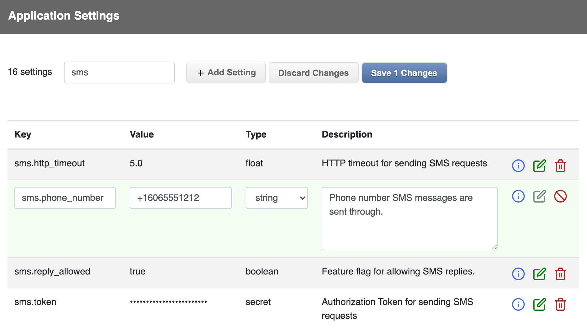

# SuperSettings

[](https://github.com/bdurand/super_settings/actions/workflows/continuous_integration.yml)
[](https://github.com/testdouble/standard)

This gem provides a mechanism for application runtime settings. Settings are stored in a database using ActiveRecord, but cached locally in memory for quick, efficient access.

The motivation behind this is that an application tends to accumulate a lot of settings over time. A lot of these may end up in environment variables or hard coded in YAML files or sprinkled through various models as additional columns. All of these methods of configuration have their place and are completely appropriate for various purposes. However, this can lead to issues if you need to change a value quickly in production:

* If you need to change a value in an environment variable, then you will need to restart processes to get the new value loaded. This can be disruptive and take a bit of time to properly roll the application. You'll also need to handle data formatting and validation in your code since you can only store strings.

* If you need to change a value hard coded in a YAML file, then you'll need to redeploy your application with an updated file.

* If you store application settings in your models, you may need to provide a caching scheme around them so that you don't slam your database with thousands of queries for values that change very infrequently.

This gem provides an out of the box web UI as well as a REST API for administering settings. You can specify data types for your settings (string, integer, float, boolean, datetime, or array) and be assured that values will be valid. You can also supply documentation for each setting so that it's obvious what each one does and how it is used.

There is also a thread safe caching mechanism that provides in memory performance while significantly limiting database load. You can tune how frequently the cache is refreshed and each refresh call is tuned to be highly efficient.

SuperSettings can be used on its own, or as a part of a larger configuration strategy for your application.

## Usage

* [Getting Value](#getting_values)
  * [Hashes](#hashes)
  * [Defaults](#defaults)
* [Data Model](#data_model)
  * [Usage Tracking](#usage_tracking)
  * [Encrypted Secrets](#encrypted_secrets)
* [Rails Engine](#rails_engine)
  * [Web UI](#web_ui)
  * [REST API](#rest_api)
  * [Configuration](#configuration)

### Getting Values

This gem is in essence a key/value store. Settings are identified by unique keys and contain a typed value. You can access setting values using methods on the `SuperSettings` object.

```ruby
SuperSettings.get("key") # -> returns a string

SuperSettings.integer("key") # -> returns an integer

SuperSettings.float("key") # -> returns a float

SuperSettings.enabled?("key") # -> returns a boolean

SuperSettings.datetime("key") # -> returns a `Time` object

SuperSettings.array("key") # -> returns an array of strings
```

#### Hashes
There is also a method to get multiple settings at once structured as a Hash.

```ruby
SuperSettings.hash("parent") # -> returns an hash
```

The key provided to the `SuperSettings.hash` method indicates the key prefix and constructs the hash from settings that have keys beginning with that prefix. Keys are also broken down by a delimiter so you can create nested hashes. The delimiter defaults to ".", but you can specify a different one with the `delimiter` keyword argument.

You can also set a maximum depth to the returned hash with the `max_depth` keyword argument.

So, if you have the following settings:

```
vendors.company_1.path = "/co1"
vendors.company_1.timeout = 5
vendors.company_2.path = "/co2"
page_size = 20
```

You would get these results:

```ruby

SuperSettings.hash("vendors") -> {"company_1" => {"path" => "/co1", "timeout" => 5}, "company_2" => {"path" => "/co2"}}

SuperSettings.hash("vendors.company_1") -> {"path" => "/co1", "timeout" => 5}

SuperSettings.hash("vendors.company_2") -> {"path" => "/co2"}

# Get all the settings by omitting the key
SuperSettings.hash
# -> {
#        "vendors" => {
#           "company_1" => {"path" => "/co1", "timeout" => 5},
#           "company_2" => {"path" => "/co2"}
#        },
#        "page_size" => 20
#      }

# Limit the depth of the returned has to one level
SuperSettings.hash(max_depth: 1)
# -> {
#        "vendors.company_1.path => "/co1",
#        "vendors.company_1.timeout" => 5,
#        "vendors.company_2.path" => "/co2",
#        "page_size" => 20
#      }

```

#### Defaults

When you request a setting, you can also specify a default value to use if the setting does not have a value.

```ruby
SuperSettings.integer("key", default: 4)
```

When you read a setting using these methods, you are actually reading from an in memory cache. All of the settings are read into this local cache and the cache is checked periodically so see if it needs to be refreshed (defaults to every five seconds, but this can be customized by setting `SuperSettings.refresh_interval`). When the cache does need to be refreshed, only updated records are re-read from the database and only by a single thread. Thus, you don't have to worry about overloading your database by reading settings values and the performance only has a slight overhead vs. reading values from a Hash.

If a setting does not exist in the database, the value will be returned as `nil`. The missing setting key will also be cached in the in memory cache, so you should avoid querying for dynamic values as a setting key since this can lead to memory bloat.

Because all settings must be read into memory, creating thousands of settings could lead to performance or memory issues loading the cache. It should be able to handle hundreds of settings just fine, though.

### Data Model

Data is stored in the `SuperSettings::Setting` model. You can update records directly with this model and the local cache will automatically be kept up to date (with the slight delay defined by `SuperSettings.refresh_interval`).

Each record has a unique key, a value, a value type, and an optional description. The value type can be one of string, integer, float, boolean, datetime, array, or secret. The array value type will always return an array of strings. The secret value type also returns a string and is used to indicate that the value contains sensitive data that should not be exposed. Secret values can be encrypted in the database as well (see below).

The value type on a setting does not limit how it can be cast when request using one of the accessor methods on `SuperSettings`. For instance, you can call `SuperSettings.get("integer_key")` on an integer setting and it will return a string. The value type does ensure that the value being input is validated to be of the specified type, though, so you can avoid invalid data.

It is not possible to store an empty string in a setting; empty strings will be cast to `nil`.

A history of all settings changes is kept every time the value is changed in the `histories` association. You can use this information to see what values were in effect at what time. You can optionally alse record who made the changes.

#### Usage Tracking

An optional feature you can turn on is to track when settings are used. This can be useful as a audit feature so you can cleanup old feature flags, etc. that are no longer in use. The timestamp of when a setting was last used will only be updated at most once per hour into the `last_used_at` field, so this adds very little overhead.

This feature does require write access on the database connection and can add overhead if a lot of keys need to be updated at once.

#### Encrypted Secrets

You can specify that a setting is a secret by setting the value type to "secret". This will obscure the value in the UI (thoough it can still be seen when editing) as well as not record the values in the setting history. You can also specify an encryption secret that is used to encrypt these settings in the database.

It is highly recommended that if you store secrets in your settings that you enable this feature. The enryption secret can either be set by setting `SuperSettings.secret` or by setting the `SUPER_SETTINGS_SECRET` environment variable.

If you need to roll your secrets, you can set the value as an array (or as a space delmited list in the environment variable). The first secret will be the one used to encrypt values. However, all the secrets will be tried when decrypting values. This allows you to change the secret without raising decryption errors. If you do change your secret, you can run this rake task to re-encrypt all values using the new secret:

```bash
rake super_settings:encrypt_secrets
```

Encryption only changes how values are stored in the database. Encrypted secrets are protected from someone gaining direct access to your database or a database backup and should be used if you are storing sensitive values. However, the values are not encrypted in the REST API or web UI. You must take appropriate measures to secure these if you choose to use them.

### Rails Engine

The gem ships with a Rails engine that provides a web UI and a REST API for creating and maintaining the settings. To use these, you need to mount the engine routes in your application's `config/routes.rb` file. The routes can be mounted under any prefix you'd like.

```ruby
mount SuperSettings::Engine => "/settings"
```

See the configuration section below for information about how to secure the controller endpoints. The engine provides no mechanism for security out of the box, but it is designed to seamlessly integrate with your application's existing authentication and authorization mechanism.

You can also easily implement your own UI if you need to since the core data structure is just an ActiveRecord model.

#### Web UI

The Web UI provides all the functionality to add, update, and delete settings.



You can save multiple settings at once. So that if you have settings that need to be changed together, you can be assured they will all be saved in a single transaction.

The Web UI is fully self contained and has no external dependencies. However, you can change the layout used by the controller (see the configuration section below for an example). If you do this, you will be responsible for providing the CSS styles for the buttons, table rows and the form controls. The CSS class names used by the default layout are compatible with the class names defined in the [Bootstrap library](https://getbootstrap.com/).

You can see the Web UI in action if you clone this repository and then run:

```bash
bin/rails db:migrate
bin/rails s
```

Then go to http://localhost:3000/settings in your browser.

#### REST API

You can invoke the REST API by sending the `Accept: application/json` request header. All paths need to be prefixed the prefix you use to mount the routes in your `config/routes.rb` file and send whatever authentication headers are needed for you application.

##### Get All Settings

```http
GET /
```

Response:
```json
[
  {
    "id": integer,
    "key": string,
    "value": object,
    "value_type": string,
    "description" string,
    "created_at": iso8601string,
    "updated_at": iso8601string,
    "encrypted": boolean
  },
  ...
]
```

The encrypted attribute is only returned if the setting has a value type of secret. It indicates if the setting is encrypted in the database.

##### Get Setting

```http
GET /settings/:id
```

Response:
```json
{
  "id": integer,
  "key": string,
  "value": object,
  "value_type": string,
  "description" string,
  "created_at": iso8601string,
  "updated_at": iso8601string,
  "encrypted": boolean
}
```

The encrypted attribute is only returned if the setting has a value type of secret. It indicates if the setting is encrypted in the database.

##### Get Setting History

```http
GET /setting/:id/history
```

Response:
```json
{
  "id": integer,
  "key": string,
  "last_used_at": iso8601string
  "histories": [
    {
      "key": string,
      "value": object,
      "changed_by": string,
      "created_at": iso8601string
    },
    ...
  ],
  "next_page_url": string,
  "previous_page_url": string
}

```

The `last_used_at` attribute is only returned if the usage tracking feature is turned on. The `next_page_url` and `previous_page_url` are returned for pagination if the full list of history items was not returned.

##### Update Settings

```http
POST /
{
  "settings": [
    {
      "key": string,
      "value": object,
      "value_type": string,
      "description": string
    },
    {
      "key": string,
      "delete": true
    },
  ]
}
```

You must provide a key in each element in the `settings` array. Providing a `value`, `value_type`, and/or `description` will insert or update the setting. Providing `delete: true` will delete the setting.

Success Response (status code 200):
```json
{"success": true}
```

Error Response (status code 422):
```json
{"success": false, "errors": [key: string, ...]}
```

#### Configuration

You can configure various aspects of the Rails engine using by calling `SuperSettings.configure` in an initializer.

```ruby
# config/initializers/super_settings.rb

SuperSettings.configure do |config|
  # These options can be used to customize the header in the web UI.
  config.controller.application_name = "My Application"
  config.controller.application_link = "/"
  config.controller.application_logo = "app_logo.png"

  # Enable the feature to track the last used time on settings.
  config.track_last_used = true

  # Set a custom refresh interval for the cache (default is 5 seconds)
  config.refresh_interval = 2

  # Set a secret used for encrypting settings with the "secret" value type.
  config.secret = "ad962cc27e02657795a61b8d48a31ce4"

  # Set the superclass to use for the controll. Defaults to using `ApplicationController`.
  config.controller.superclass = Admin::BaseController

  # Add additional code to the controller. In this case we are adding code to ensure only
  # admins can access the functionality and changing the layout to use one defined by the application.
  config.controller.enhance do
    self.layout = "admin"

    before_action do
      require_admin
    end

    private

    def require_admin
      if current_user.nil?
        redirect_to login_url, status: 401
      else
        redirect_to access_denied_url, status: 403
      end
    end
  end

  # Define a method that returns the value that will be stored in the settings history in
  # the `changed_by` column.
  config.controller.define_changed_by do
    current_user.name
  end

  # The models can also have code injected into them with these methods:
  # config.model.enhance do
  # end
  #
  # config.model.enhance_history do
  # end

  # You can also specify a cache implementation to use to cache the last updated timestamp
  # for model changes. By default this will use `Rails.cache`.
  # config.model.cache = Rails.cache
end
```

One configuration you will probably want to set is the superclass for the controller. By default, the base `ApplicationController` defined for your application will be used. However, if you want to provide Your application probably already has a

## Installation

Add this line to your application's Gemfile:

```ruby
gem 'super_settings'
```

And then execute:
```bash
$ bundle
```

Or install it yourself as:
```bash
$ gem install super_settings
```

## Contributing

Open a pull request on GitHub.

Please use the [standardrb](https://github.com/testdouble/standard) syntax and lint your code with `standardrb --fix` before submitting.

## License

The gem is available as open source under the terms of the [MIT License](https://opensource.org/licenses/MIT).
